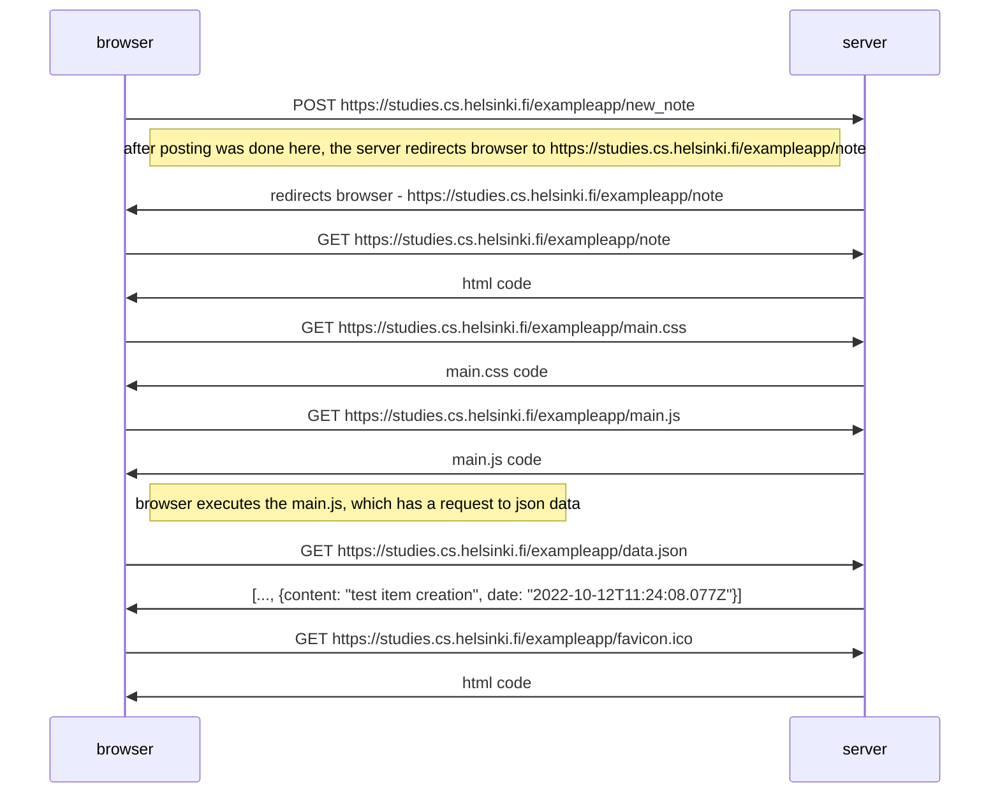

```
sequenceDiagram
browser->>server: POST https://studies.cs.helsinki.fi/exampleapp/new_note
Note left of server: after posting was done here, the server redirects browser to  https://studies.cs.helsinki.fi/exampleapp/note

server->>browser: redirects browser - https://studies.cs.helsinki.fi/exampleapp/note


browser->>server: GET https://studies.cs.helsinki.fi/exampleapp/note
server->>browser: html code
browser->>server: GET https://studies.cs.helsinki.fi/exampleapp/main.css
server->>browser: main.css code
browser->>server: GET https://studies.cs.helsinki.fi/exampleapp/main.js
server->>browser: main.js code

Note right of browser: browser executes the main.js, which has a request to json data

browser->>server: GET https://studies.cs.helsinki.fi/exampleapp/data.json
server->>browser: [..., {content: "test item creation", date: "2022-10-12T11:24:08.077Z"}]

browser->>server: GET https://studies.cs.helsinki.fi/exampleapp/favicon.ico
server->>browser: html code
```


